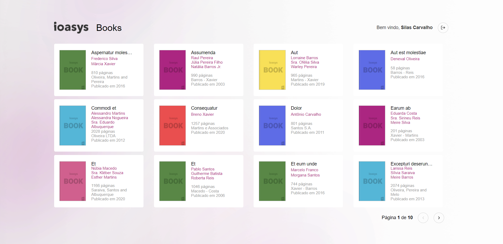

<h2 align="center">Projeto Ioasys Books</h2>

<h2><strong>:satellite:Tecnologias utilizadas*</strong></h2>

<h2>Frontend</h2>
<h3>ReactJS  </h3>

<h2>Testes unitários</h2>
<h3>Testing Livrary </h3>

<h2>Linter</h2>
<h3>Eslint </h3>

<h2>Code Formater</h2>
<h3>Prettier </h3>

## 🚀 Telas aplicação web

	
	
	

### Instalando aplicação

Execute o comando `npm install` na raiz do projeto para instalar as dependências.

Após executado o código acima, execute o comando `npm start` .

> Obs: Será aberto na porta 3000
> Obs: Dados de login: usuario: desafio@ioasys.com.br senha: 12341234

### Pontos para Melhorar

Estilização do card de livros

Estilização do detalhamento do livro

<h4>Dúvidas entre em contato pelo <a href="https://www.linkedin.com/in/marco-antonio-monteiro-de-brito-541ba0144/" target="_blank">Linkedin</a> </h4>

<h4 align="center"> <em>&lt;/&gt;</em> by <a href="https://github.com/marcomonteirobrito" target="_blank">marcomonteirobrito</a> </h4>
